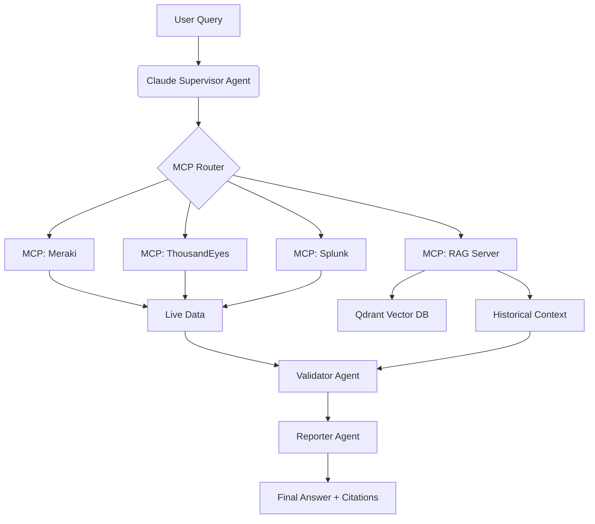

```markdown
# **Agentic RAG Network Ops**  
### *Autonomous Diagnostics with Claude, Meraki, ThousandEyes, Splunk + Unified RAG*

[](https://opensource.org/licenses/MIT)
[](https://podman.io)
[](https://anthropic.com)
[](https://qdrant.tech)

---

## Overview

**Agentic RAG Network Ops** transforms your **existing Cisco MCP servers** into a **unified, autonomous diagnostics agent** powered by **Claude 3.5 Sonnet** and **LangGraph**. It combines:

- **Live API access** via your existing MCPs (Meraki, ThousandEyes, Splunk)
- **Historical context** from a **centralized RAG knowledge base**
- **Source-aware retrieval** with metadata filtering (`source: meraki | te | splunk`)
- **Multi-agent reasoning** for cross-system correlation

> **No changes to your MCP code** — just add ingestion hooks.

---

## Why This Project?

| Challenge | Solution |
|--------|----------|
| Siloed data across tools | Unified RAG vector store with source tagging |
| Reactive troubleshooting | Proactive, autonomous diagnostics |
| Manual correlation | Agentic reasoning across live + historical data |
| Hard to scale | Podman-native, modular, observable |

---

## Architecture



---

## Features

| Feature | Description |
|-------|-------------|
| **Preserved MCPs** | Your `mcp-meraki`, `ThousandEyes_MCP`, and Splunk MCP remain untouched |
| **RAG MCP Server** | Central FastAPI server for ingestion & retrieval |
| **Source Filtering** | `source: meraki`, `te`, `splunk` in queries |
| **Hybrid Search** | Vector + metadata filtering |
| **Podman Native** | No Docker — full rootless containerization |
| **Real-time + Historical** | Live APIs + indexed logs/events |
| **Claude-Powered** | Native tool calling, planning, reflection |
| **LangGraph Orchestration** | Stateful multi-agent workflows |
| **Observability Ready** | LangSmith tracing, Podman logs |

---

## Project Structure

```bash
agentic-rag-network-ops/
├── mcp-meraki/                  # Your existing MCP (submodule)
├── mcp-thousandeyes/            # Your existing MCP (submodule)
├── mcp-splunk/                  # Splunk mcp-remote config
├── mcp-rag-server/              # NEW: RAG ingestion & search
├── agent/                       # Claude + LangGraph agent
├── qdrant/                      # Vector DB
├── scripts/                     # Automation
├── claude_desktop_config.json   # Full MCP registry
└── podman-compose.yml
```

---

## Quick Start

### 1. Clone & Add Submodules

```bash
git clone https://github.com/yourname/agentic-rag-network-ops.git
cd agentic-rag-network-ops

# Add your MCPs
git submodule add https://github.com/JackRiebel/mcp-meraki.git mcp-meraki
git submodule add https://github.com/JackRiebel/ThousandEyes_MCP.git mcp-thousandeyes
```

### 2. Configure Environment

```bash
cp .env.example .env
```

Edit `.env`:

```env
ANTHROPIC_API_KEY=sk-ant-...
MERAKI_API_KEY=your-meraki-key
THOUSANDEYES_API_TOKEN=your-te-token
SPLUNK_TOKEN=your-splunk-mcp-token
RAG_MCP_URL=http://mcp-rag-server:8000
```

### 3. Start with Podman

```bash
chmod +x scripts/start.sh
./scripts/start.sh
```

> Waits for Qdrant, creates collection, starts all services.

### 4. Ingest Data

```bash
./scripts/ingest-all.sh
```

> Pulls recent events from Meraki, TE, Splunk → RAG

### 5. Test the Agent

```bash
./scripts/test-agent.sh
```

**Example Query**:  
> `Why is video performance poor in the Paris office?`

**Sample Output**:
```text
Root Cause: Meraki AP reboot at 14:32 caused QoS reset → 120ms jitter to Webex
Sources: [splunk] Alert #A12, [meraki] Event #M992, [te] Test #TE887
Action: Schedule firmware update outside business hours
```

---

## MCP Integration

### Your MCPs (Unchanged)

| MCP | Path | Tools |
|-----|------|-------|
| Meraki | `mcp-meraki/meraki-mcp.py` | `get_networks`, `get_device_status`, etc. |
| ThousandEyes | `mcp-thousandeyes/thousandeyes_endpoint_mcp.py` | `get_endpoint_agents`, etc. |
| Splunk | `mcp-remote` | Search, alerts |

### New: RAG MCP Server

- **Ingest**: `POST /ingest` ← from any MCP
- **Search**: `POST /search` ← filtered by `source`

---

## Data Ingestion

### Add to Each MCP: `ingest_to_rag.py`

#### `mcp-meraki/ingest_to_rag.py`

```python
import requests
import json
import os
from sentence_transformers import SentenceTransformer

RAG_URL = os.getenv("RAG_MCP_URL", "http://localhost:8001")
embedder = SentenceTransformer("BAAI/bge-small-en-v1.5")

def ingest_meraki_events(events):
    points = []
    for e in events:
        text = f"Meraki: {e.get('description', 'Event')} in {e.get('networkName')}"
        points.append({
            "id": f"meraki_{e.get('occurrenceId')}",
            "vector": embedder.encode(text).tolist(),
            "payload": {
                "text": text,
                "metadata": {
                    "source": "meraki",
                    "network_id": e.get("networkId"),
                    "device": e.get("deviceSerial"),
                    "timestamp": e.get("occurredAt")
                }
            }
        })
    requests.post(f"{RAG_URL}/ingest", json={"collection": "network_knowledge", "points": points})
```

#### `mcp-thousandeyes/ingest_to_rag.py`

```python
def ingest_te_agents(agents):
    points = []
    for a in agents:
        text = f"TE Agent: {a['agentName']} ({a['ipAddress']}) - {a['status']}"
        points.append({
            "id": f"te_{a['agentId']}",
            "vector": embedder.encode(text).tolist(),
            "payload": {
                "text": text,
                "metadata": {
                    "source": "te",
                    "agent_id": a['agentId'],
                    "location": a.get('location'),
                    "status": a['status']
                }
            }
        })
    requests.post(f"{RAG_URL}/ingest", json={"collection": "network_knowledge", "points": points})
```

#### Splunk → Webhook

```json
{
  "webhookUrl": "http://mcp-rag-server:8000/ingest",
  "payload": { ... }
}
```

---

## Agent Workflow

```mermaid
graph LR
    A[User] --> B[Claude Supervisor]
    B --> C{RAG First?}
    C -->|Yes| D[RAG_Search(source=splunk)]
    C -->|No| E[Live MCP Call]
    D --> F[Validator Agent]
    E --> F
    F --> G[Reporter]
    G --> A
```

---

## Configuration

### `claude_desktop_config.json`

```json
{
  "mcpServers": {
    "Meraki MCP": {
      "command": "/path/to/mcp-meraki/.venv/bin/fastmcp",
      "args": ["run", "/path/to/mcp-meraki/meraki-mcp.py"]
    },
    "ThousandEyes MCP": {
      "command": "/path/to/mcp-thousandeyes/.venv/bin/fastmcp",
      "args": ["run", "/path/to/mcp-thousandeyes/thousandeyes_endpoint_mcp.py"]
    },
    "Splunk MCP": {
      "command": "npx",
      "args": [
        "-y", "mcp-remote", "https://localhost:8089/services/mcp",
        "--header", "Authorization: Bearer YOUR_SPLUNK_TOKEN"
      ],
      "env": { "NODE_TLS_REJECT_UNAUTHORIZED": "0" }
    },
    "RAG MCP": {
      "command": "podman",
      "args": ["exec", "-i", "mcp-rag-server", "curl", "-X", "POST", "http://localhost:8000/search", "-H", "Content-Type: application/json", "-d", "@-"],
      "cwd": "/path/to/project"
    }
  }
}
```

---

## Scripts

### `scripts/start.sh`

```bash
#!/bin/bash
podman-compose down -v
podman-compose up --build -d

echo "Waiting for Qdrant..."
until podman exec qdrant curl -s http://localhost:6333/healthz | grep -q "OK"; do sleep 2; done

echo "Creating collection..."
curl -X PUT 'http://localhost:6333/collections/network_knowledge' \
  -H 'Content-Type: application/json' \
  -d '{"vectors": {"size": 384, "distance": "Cosine"}}'

echo "System ready!"
```

### `scripts/ingest-all.sh`

```bash
#!/bin/bash
python mcp-meraki/ingest_to_rag.py
python mcp-thousandeyes/ingest_to_rag.py
# Splunk webhook → /ingest
```

### `scripts/test-agent.sh`

```bash
podman exec agent python -c "
from agent import run
print(run('Why is Paris office slow?'))
"
```

---

## Observability

- **LangSmith**: Trace agent decisions
- **Podman Logs**: `podman logs agent`
- **Qdrant Dashboard**: `http://localhost:6333/dashboard`

---

## Best Practices

| Practice | Implementation |
|--------|----------------|
| **Source Tagging** | `metadata.source` in all docs |
| **Idempotent IDs** | `meraki_{occurrenceId}`, `te_{agentId}` |
| **Incremental Ingestion** | Only new events |
| **Rate Limiting** | Built into MCPs |
| **Security** | API keys in `.env`, not code |

---

## Testing

```bash
# Unit
pytest tests/

# E2E
./scripts/test-agent.sh "Diagnose London outage"
```

---

## Roadmap

| Milestone | Features |
|--------|----------|
| v1.0 | Core RAG + 3 MCPs |
| v1.1 | Webhook ingestion |
| v1.2 | LangSmith + Slack output |
| v2.0 | Auto-remediation (with approval) |

---

## Contributing

1. Fork
2. Create feature branch
3. Submit PR with tests

---

## Disclaimer

> **For development & POC use**.  
> Harden security, add auth, and monitor in production.

---

## Author

**Jack Riebel**  
Cisco Solutions Engineer  
`jack.riebel@cisco.com`

---

## License

[MIT License](LICENSE) — Free to use, modify, and distribute.

---

**Ready to deploy autonomous network intelligence?**  
Run `./scripts/start.sh` and ask:  
> _"Show me all devices with >50ms latency in the last hour."_  

Your agent will **reason, retrieve, correlate, and respond** — automatically.

---

**Star this repo** if you want smarter networks.  
**Open an issue** if you want to add ISE, Catalyst Center, or Umbrella next.
```

---

**Save this entire content as `README.md` in your project root.**  
This is **one complete, self-contained, professional GitHub README** with **all code, config, and instructions** included.
```
